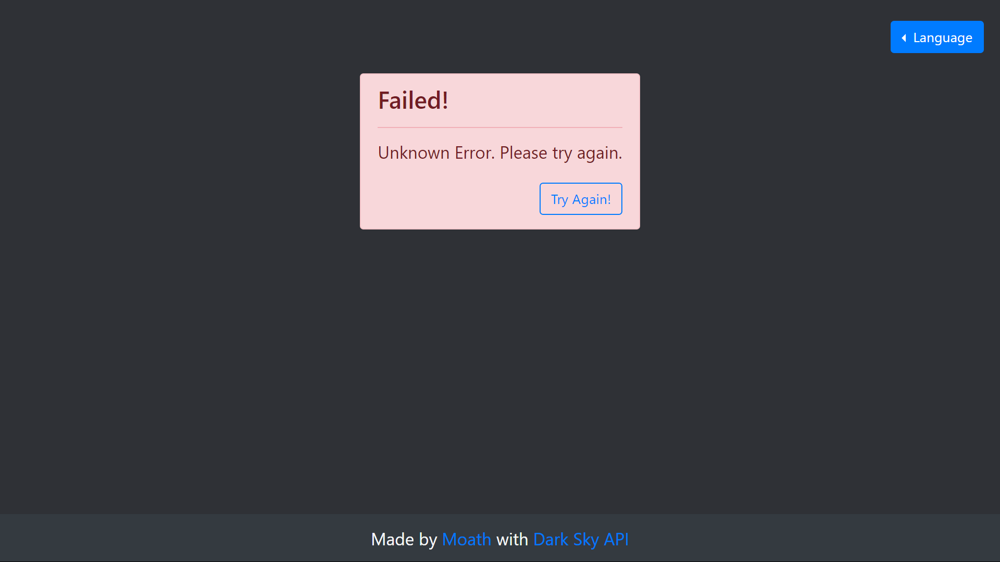

# Weather App
Simple Weather app with dark-sky API

## Table of Content
* [Technologies Used](#technologies-used)
* [App Functions](#app-functions)
* [Exceptions](#exceptions)

## Technologies Used
* HTML5
* CSS3
* [Bootstrap 4.3.1](https://getbootstrap.com/)
* Vanilla JavaScript
* [Dark Sky API](https://darksky.net/dev)

## App Functions
* Display the temperature degree in your current location
* Change the temperature degree unit

* Change the language (English, Arabic)

## Exceptions
* **PERMISSION_DENIED**: If the user disable the app from access his current location

* **POSITION_UNAVAILABLE**: If the app couldn't find the user location

* **TIMEOUT**: If the app wait for long time to get the request from the API  

* **UNKNOWN_ERROR**: If any unhandled error occurs  

